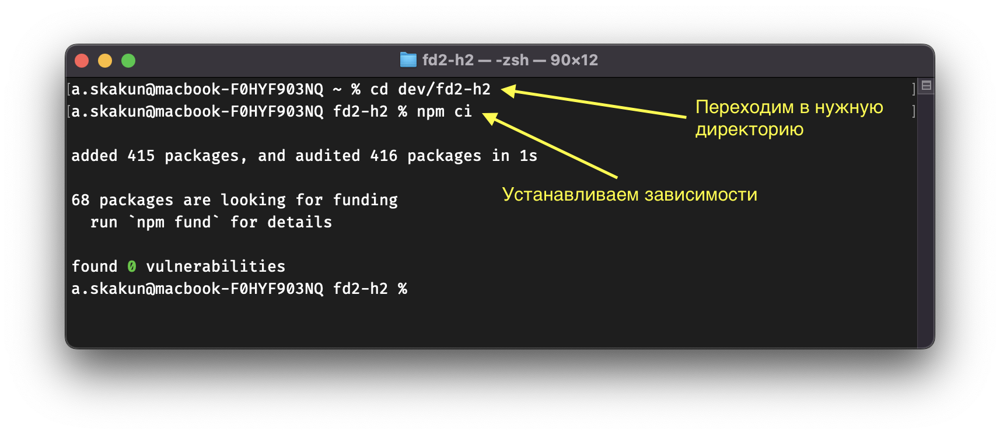
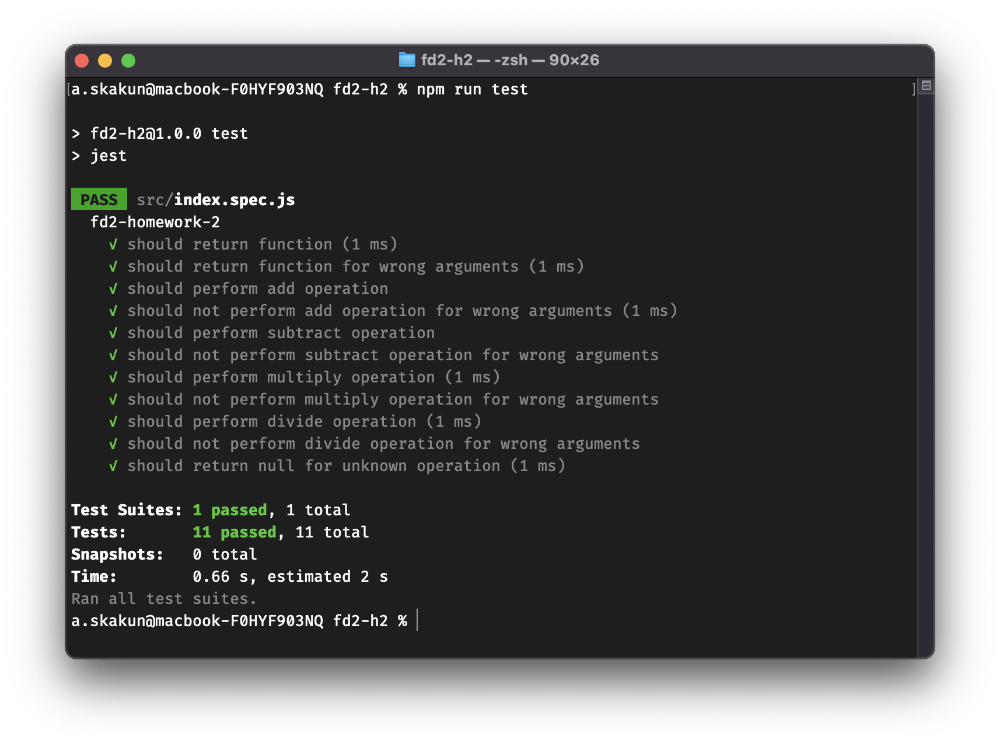

# Homework #2

```
Вносите изменения в файл ./src/index.js 
```

## Задание

Создайте функцию `calc`, которая должна принимать два числа и возвращать новую функцию.
Новая функция должна принимать в качестве аргумента одно из четырёх возможных действий:

- сложение `'add'`,
- вычитание `'subtract'`
- умножение `'multiply'`
- деление `'divide'`

Результатом функции должен быть результат указанного действия над двумя числами.

### Пример

```javascript
calc(4, 6)('add'); // вернёт 10
calc(4, 6)('subtract'); // вернёт -2
calc(4, 6)('multiply'); // вернёт 24
calc(4, 6)('divide'); // вернёт 0.6666666666666666
```

> Убедитесь что функции отрабатывают корректно только с правильными аргументами.
> В любом из случаев, когда выполнить операцию над числами не возможно, результатом должен быть `null`.

### Автоматическая проверка

Чтобы воспользоваться автоматической проверкой, предварительно должен быть установлен [Node.js](https://nodejs.org/en/).

#### Установка зависимостей

1. Откройте терминал и перейдите в директорию с данным проектом
2. Выполните команду `npm ci` и дождитесь её завершения



#### Запуск тестов

Для запуска тестов выполните в терминале команду `npm run test` в директории с проектом.


